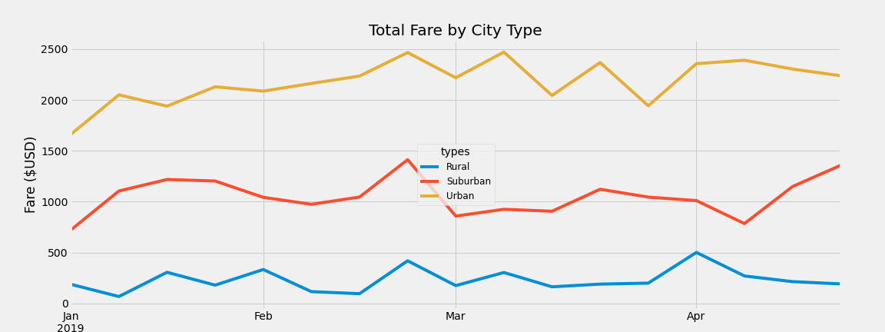

# PyBer Analysis
Analyze all the rideshare data from January to early May of 2019 and create a compelling visualization for the CEO

## Overview

> Analyze the data of Rides vs fare and driver counts across different city types. 

* In this Module, the Pandas and Matplotlib are the major dependencies used in the analysis. 
* Data filtering, formatting, and data pivot are used
* Most charts are practiced and the multi-line chart is used in the challenge
* Use data frame and object orient interface to generate the chart with the continuous date as the axis.
* Chart formatting and saving.

## Results

According to the table, urban cities are the major contributor to the revenue. they have the largest ride count, driver count, and total fare. On the contrary, the rural area contributes the least. However, rural area has higher average fare, both in each ride and for each driver.

According to the chart, from January to April in 2019. Average urban cities' weekly fares are over $2000; Suburban cities have about $1000 for each city per week; Rural areas are always less than $500. No big fluctuation was detected during these 4 months.

## Summary

> Based on the results, provide three business recommendations to the CEO for addressing any disparities among the city types.

1. Launch a discount promotion in the rural areas to boost driver registering, and stimulate ride count and lower the average fare per ride;
2. Increase average rate in urban cities by launching a campaign with premium features, then increase average fare per ride, which will increase drivers' income and reduce the overall loading;
3. limit the urban driver registration to prevent competition and improve service quality.
